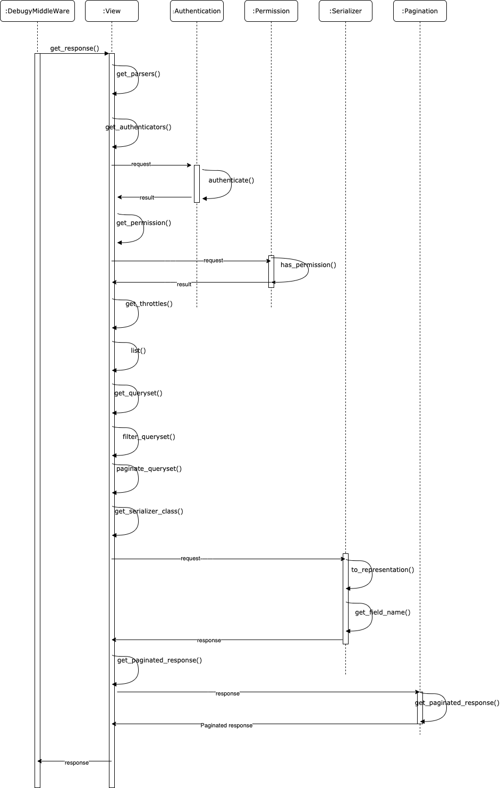
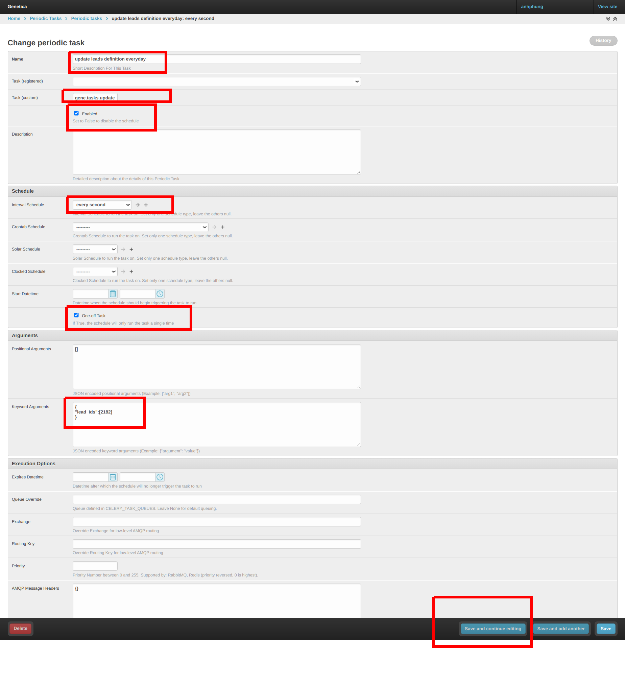

This is initial code for create sample codes in in django rest framework
---

- [1. setup environment](#1-setup-environment)
- [2. create project and new app](#2-create-project-and-new-app)
  - [2.1. create project](#21-create-project)
  - [2.2. app coordinate](#22-app-coordinate)
  - [2.3. app screen](#23-app-screen)
  - [2.4. create sample data](#24-create-sample-data)
- [3. Deploy](#3-deploy)
  - [3.1. Live](#31-live)
  - [3.2. Using docker](#32-using-docker)
  - [3.3. Test](#33-test)
    - [3.3.1. Access swagger](#331-access-swagger)
      - [3.3.1.1. customize swagger schema](#3311-customize-swagger-schema)
    - [3.3.2. Access admin site](#332-access-admin-site)
    - [3.3.3. Access users/groups apis](#333-access-usersgroups-apis)
- [4. Music app](#4-music-app)
  - [4.1. Create new app and migrate database](#41-create-new-app-and-migrate-database)
  - [4.2. Views](#42-views)
    - [4.2.1. musican-api-views](#421-musican-api-views)
    - [4.2.2. musican-generic-views](#422-musican-generic-views)
    - [4.2.3. musican-viewset](#423-musican-viewset)
    - [4.2.4. musican-debug](#424-musican-debug)
  - [4.3. Serializers](#43-serializers)
    - [4.3.1. Common serializer](#431-common-serializer)
    - [4.3.2. Model serializer](#432-model-serializer)
    - [4.3.3. Custom django command to add](#433-custom-django-command-to-add)
    - [4.3.4. celery task using django_celery_beat](#434-celery-task-using-django_celery_beat)
- [5. Using serializer effectively](#5-using-serializer-effectively)
  - [5.1. In read data](#51-in-read-data)
    - [5.1.1. Using source keyword](#511-using-source-keyword)
    - [5.1.2. Using SerializerMethod](#512-using-serializermethod)
    - [5.1.3. Using to_representation](#513-using-to_representation)
  - [5.2. In write data](#52-in-write-data)
    - [5.2.1. Add custom field validator](#521-add-custom-field-validator)
    - [5.2.2. Cross field validation](#522-cross-field-validation)
    - [5.2.3. When and how to override to_internal_value()](#523-when-and-how-to-override-to_internal_value)
    - [5.2.4. When and how to override create()](#524-when-and-how-to-override-create)
  - [5.3. Other things](#53-other-things)
    - [5.3.1. Passing a value directly to the save method](#531-passing-a-value-directly-to-the-save-method)
    - [5.3.2. Get current user of the request](#532-get-current-user-of-the-request)
    - [5.3.3. HiddenField](#533-hiddenfield)
    - [5.3.4. access serializer raw input](#534-access-serializer-raw-input)
    - [5.3.5. Override data to force ordering](#535-override-data-to-force-ordering)
    - [5.3.6. Handling multiple creates/updates/deletes in nested serializers](#536-handling-multiple-createsupdatesdeletes-in-nested-serializers)
- [6. Other tricks](#6-other-tricks)
  - [6.1. django-rest-framework-tricks](#61-django-rest-framework-tricks)
  - [6.2. Customizing the generic views](#62-customizing-the-generic-views)
- [7. QuerySet](#7-queryset)
- [8. Search-Filter-Ordering](#8-search-filter-ordering)
  - [8.1. Filter base on url and query params](#81-filter-base-on-url-and-query-params)
  - [8.2. Using 3rd Filter Class](#82-using-3rd-filter-class)
  - [8.3. Search](#83-search)
  - [8.4. Ordering](#84-ordering)
  - [8.5. Compose search filter ordering in one viewsets](#85-compose-search-filter-ordering-in-one-viewsets)
- [9. Pagination](#9-pagination)
- [10. Sequence diagram](#10-sequence-diagram)
  - [10.1. List api](#101-list-api)
- [11. Add nginx configs](#11-add-nginx-configs)
  - [11.1. Config for http only](#111-config-for-http-only)
  - [11.2. Config for https self-certificates](#112-config-for-https-self-certificates)
  - [11.3. Config for https certbot certificates](#113-config-for-https-certbot-certificates)
  - [11.4. nginx basic auth](#114-nginx-basic-auth)
- [12. Add sonarqube](#12-add-sonarqube)
  - [12.1. deploy](#121-deploy)
  - [12.2. how to using sonarqube](#122-how-to-using-sonarqube)
- [13. Debug django app](#13-debug-django-app)
  - [13.1. Live](#131-live)
  - [13.2. Docker](#132-docker)
    - [13.2.1. Add debug code](#1321-add-debug-code)
    - [13.2.2. Run debug on vscode](#1322-run-debug-on-vscode)
    - [13.2.3. Exit debug mode on vscode](#1323-exit-debug-mode-on-vscode)
  - [13.3. Remote](#133-remote)
- [14. Linting code](#14-linting-code)
- [15. Celery](#15-celery)
  - [15.1. logging and test](#151-logging-and-test)
  - [15.2. test celery from admin](#152-test-celery-from-admin)
- [16. Add debug tool bar](#16-add-debug-tool-bar)
- [17. Add sentry](#17-add-sentry)

# 1. setup environment

```shell
pyenv install -v 3.9.0
pyenv local 3.9.0
python --version
which python
venv-create     # if it detect wrong version of python, it need to open another shell
.venv
which python
pip install -r requirements.txt

# mac 
brew install jq
# ubuntu
sudo apt-get install jq -y
```

# 2. create project and new app

create this app as link: https://www.django-rest-framework.org/tutorial/quickstart/

## 2.1. create project

**NOTE**: Ignore this step if User app is created

```shell
django-admin startproject main .
django-admin startapp user
```

## 2.2. app coordinate

```shell
django-admin startapp coordinate
make coordinate-add
make coordinate-list-descending
```

## 2.3. app screen

```shell
django-admin startapp screen

make screen-unlock-update
make screen-unlock-get
make screen-unlock-unlock
```

## 2.4. create sample data

```shell
make create-sample-data
```

# 3. Deploy

## 3.1. Live

```shell
cp env_file.example env_file
# update env_file content then:
make run
```

## 3.2. Using docker

For development environment (for other env just change prefix, ex: dev -> prod)


```shell
cp env_file.example env_file
# update env_file content then:

make dev-build
make dev-up
make dev-ps
```

## 3.3. Test

### 3.3.1. Access swagger

http://127.0.0.1:8027/swagger/

http://127.0.0.1:80/swagger/

https://127.0.0.1:443/swagger/

#### 3.3.1.1. customize swagger schema

Reference: https://drf-yasg.readthedocs.io/en/stable/custom_spec.html

using 2 decorator : `@swagger_auto_schema` and `@swagger_serializer_method`

Example using `@swagger_auto_schema` in file: [source/music/views/api_views.py#49](source/music/views/api_views.py#49)

And example using `@swagger_serializer_method` here: https://drf-yasg.readthedocs.io/en/stable/custom_spec.html#support-for-serializermethodfield

### 3.3.2. Access admin site

Account as above: admin/admin
  
**Admin normal**

http://127.0.0.1:8027/admin   ==> NOTE: when run server using gunicorn, static file will not found

http://127.0.0.1:80/admin

https://127.0.0.1:443/admin

### 3.3.3. Access users/groups apis

http://127.0.0.1:8027/api/v1

http://127.0.0.1:80/api/v1

https://127.0.0.1:443/api/v1


login by above account: admin/admin

or by command: 

```shell
make user-get
```

[music/serializers.py](music/serializers.py)

# 4. Music app

## 4.1. Create new app and migrate database

```shell
# django-admin startapp music
make makemigrations
make migrate
```
access: http://127.0.0.1:8027/swagger/

## 4.2. Views
### 4.2.1. musican-api-views

This set of apis describe how to using `APIView` to make api as basic and normal, code will be handle by yourself

**Test:**

```shell
make musican-api-views-
```

**Conclusion:**

Using api views when you want to custom detail in your api

### 4.2.2. musican-generic-views

This set of apis describe how to using `generics` view to make api code will be made shorter

**Test:**

```shell
make musican-generic-views-
```

**Conclusion:**

Using generic view when you want to combine some methods in one view, but not all, ex: only allow methods: CREATE/GET/LIST

### 4.2.3. musican-viewset

This set of apis describe how to using `ModelViewSet` to make code shortest

**Test:**

```shell
make musican-viewset-
```

**Conclusion:**

Using viewset when you want to add all methods(actions) of a object in one view, all methods will be routed automatically

### 4.2.4. musican-debug

This apis help to debug all django rest framework flow, how a request is handled through all layers of this framework

To run this debug code see debug part in this file

## 4.3. Serializers

### 4.3.1. Common serializer

This type of serializer you don't need to specify your model, but you must declare all necessary fields manually

Ex: **MusicianSerializer** [music/serializers.py](music/serializers.py)

Ex: using this serializer here: [music/generic_views.py](music/generic_views.py)

### 4.3.2. Model serializer

You must specify your model in **Meta class**

You don't need to specify model field

Ex: [music/model_serializers.py](music/model_serializers.py)

### 4.3.3. Custom django command to add 

See custom command in this file [source/music/management/commands/get_musican_by_email.py](source/music/management/commands/get_musican_by_email.py)

And run test:

```shell
make docker-test-command-get-musican-by-email
```

### 4.3.4. celery task using django_celery_beat

```shell
# NOTE: create celery task by this lib will don't need to restart worker and beat 
# like create task in celeryconfig.py
make docker-create-periodic-task

# to see result
tailf source/logs/celery.task.log
tailf source/logs/celery.beat.log
# or
docker logs -f sample-celery-beat
docker logs -f sample-celery-worker
```

# 5. Using serializer effectively

## 5.1. In read data

### 5.1.1. Using source keyword

Reference: https://medium.com/better-programming/how-to-use-drf-serializers-effectively-dc58edc73998

Using `source when you only want to get data, but not modify anything

code sample in this serializer: **MusicianModelSerializerReadEffective_SourceKeyword** in this file: [source/music/sample_using_serializer_effective/serializers.py](source/music/sample_using_serializer_effective/serializers.py)

- source=field_name to rename of this returned field, ex: `source='first_name'`
- source=Model.method() to get modified data, ex: `source='get_full_name'`
- source worker with relationships, ex: `OneToMany` or`ForeignKey`, `OneToOneField`, and `ManyToMany`
  - ex: `source='profile.street'` or `source='profile.city`
- source worker with methods of related objects, same `Model.method()`, ex: `source="profile.get_full_address"`
- source work with `OneToMany`, ex: `source='album_set'`. **NOTE** with `ManyToMany` don't need `source`, ex: `instruments` field

### 5.1.2. Using SerializerMethod

Using `SerializerMethod` when you want to custom more output data. For example:

- Convert `first_name` to titlecase during serialization.
- Convert `full_name` to uppercase.
- Set `albums` as `None` instead of an empty list if no groups are associated with the user.

All example in this serializer: **MusicianModelSerializerReadEffective_SerializerMethod** in file [source/music/sample_using_serializer_effective/serializers.py](source/music/sample_using_serializer_effective/serializers.py)

### 5.1.3. Using to_representation

Using to_representation when you want to custom multiple data fields

All example in this serializer: **MusicianModelSerializerReadEffective_SerializerMethod** in file [source/music/sample_using_serializer_effective/serializers.py](source/music/sample_using_serializer_effective/serializers.py)


## 5.2. In write data

Reference: https://medium.com/@raaj.akshar/how-to-effectively-use-django-rest-framework-serializers-during-write-operations-dd73b62c26b5

### 5.2.1. Add custom field validator

Using it when want to validate a single field

Ex: field `password` in **MusicianModelSerializerReadEffective_SourceKeyword.validate_password()**

### 5.2.2. Cross field validation

Using it when we want to add some validation where we need to access multiple field simultaneously

Ex: validate that the `first_name` and `last_name` be different in **MusicianModelSerializerReadEffective_SourceKeyword.validate()**

### 5.2.3. When and how to override to_internal_value()

`to_internal_value()`  can be used to do some pre-processing before validation code is executed

Ex 1: Frontend or mobile app sends user information enclosed in another dictionary with key `user`

```json
{
	'user': {
		'first_name': 'john',
		'last_name': 'doe',
		'username': 'john',
		'password': 'abc123#'
	}
}
```

In such case, `user` info needs to be extracted out of the dictionary before the fields are validated. We can achieve this by overriding `to_internal_value()` in **MusicianModelSerializerReadEffective_SourceKeyword.to_internal_value()**

### 5.2.4. When and how to override create()

`create()` is called when `serializer.save()` is called

create() should be overridden when we want to do something different from this default behavior.

## 5.3. Other things

### 5.3.1. Passing a value directly to the save method

```python
serializer = EmailSerializer(data=request.data)
serializer.is_valid(raise_exception=True)
serializer.save(owner_id=request.user.id)   # <------ this passed value won't be validated
											# It may be used to force an override of the initial data
```

### 5.3.2. Get current user of the request

```python
serializers.CurrentUserDefault()
```

### 5.3.3. HiddenField

HiddenField is a field class that does not take a value based on user input, but instead takes its value from a default value or callable.

```python
modified = serializers.HiddenField(default=timezone.now)
owner = serializers.HiddenField(default=serializers.CurrentUserDefault())
```

### 5.3.4. access serializer raw input

`serializer.initial_data`

### 5.3.5. Override data to force ordering

By default, Django querysets are not ordered at all. Enforcing ordering on the list view can easily be accomplished by adding ordering to the view’s `queryset`, but in cases where nested resources should also be ordered, it’s not so simple. For read-only fields, it can be done within `SerializerMethodField`, but what to do in a situation where a field has to be writable? In such a case, a serializer’s data property can be overridden, as shown in this example:

```python
@property
def data(self):
    data = super().data
    data['phone_numbers'].sort(key=lambda p: p['id'])
    return data
```

### 5.3.6. Handling multiple creates/updates/deletes in nested serializers

There are two paths you can follow in this case:

- use the quite popular, third party library DRF Writable Nested
- do it on your own
  
I would recommend choosing the second option at least once, so you will know what’s going underneath.

After analyzing incoming data, in most scenarios, we are able to make the following assumptions:

- all items that should be updated have id,
- all items that should be created don’t have id,
- all items that should be deleted are present in data storage (eg. database), but are missing in the incoming request.data
  
Based on this, we know what to do with particular items on the list. Below is a snippet that shows this process in detail:

```python
class CUDNestedMixin(object):
    @staticmethod
    def cud_nested(queryset: QuerySet,
                   data: List[Dict],
                   serializer: Type[Serializer],
                   context: Dict):
        """
        Logic for handling multiple updates, creates and deletes
        on nested resources.
        :param queryset: queryset for objects existing in DB
        :param data: initial data to validate passed from higher
                level serializer to nested serializer
        :param serializer: nested serializer to use
        :param context: context passed from higher level
                serializer
        :return: N/A
        """
        updated_ids = list()
        for_create = list()
        for item in data:
            item_id = item.get('id')
            if item_id:
                instance = queryset.get(id=item_id)
                update_serializer = serializer(
                    instance=instance,
                    data=item,
                    context=context
                )
                update_serializer.is_valid(raise_exception=True)
                update_serializer.save()
                updated_ids.append(instance.id)
            else:
                for_create.append(item)

        delete_queryset = queryset.exclude(id__in=updated_ids)
        delete_queryset.delete()

        create_serializer = serializer(
            data=for_create,
            many=True,
            context=context
        )
        create_serializer.is_valid(raise_exception=True)
        create_serializer.save()
```

And here is the simplified version of how a high-level serializer can make use of this mixin:

```python
from rest_framework import serializers

class AccountSerializer(serializers.ModelSerializer,
                        CUDNestedMixin):
    phone_numbers = PhoneSerializer(
        many=True,
        source='phone_set',
    )

    class Meta:
        model = User
        fields = ('first_name', 'last_name', 'phone_numbers')

    def update(self, instance, validated_data):
        self.cud_nested(
            queryset=instance.phone_set.all(),
            data=self.initial_data['phone_numbers'],
            serializer=PhoneSerializer,
            context=self.context
        )
        ...
        return instance
```

Keep in mind that nested objects should consume `initial_data` instead of `validated_data`. That’s because running validation calls `field.to_internal_value()` on each of a serializer’s fields, which may modify data stored by a particular field (eg. by changing primary key to model instance).


# 6. Other tricks

## 6.1. [django-rest-framework-tricks](https://github.com/barseghyanartur/django-rest-framework-tricks)

## 6.2. [Customizing the generic views](https://www.django-rest-framework.org/api-guide/generic-views/#customizing-the-generic-views)


# 7. QuerySet

https://docs.djangoproject.com/en/3.1/topics/db/queries/

A django queryset is like its name says, basically a collection of (sql) queries, in your example above print(b.query) will show you the sql query generated from your django filter calls.

Since querysets are lazy, the database query isn't done immediately, but only when needed - when the queryset is evaluated. This happens for example if you call its __str__ method when you print it, if you would call list() on it, or, what happens mostly, you iterate over it (for post in b..). This lazyness should save you from doing unnecessary queries and also allows you to chain querysets and filters for example (you can filter a queryset as often as you want to).


# 8. Search-Filter-Ordering

Refer: https://www.django-rest-framework.org/api-guide/filtering/#filtering-against-the-current-user

## 8.1. Filter base on url and query params

```python
    # re_path('^purchases/(?P<username>.+)/$', PurchaseList.as_view()),
    
    def get_queryset(self):
        """
        This view should return a list of all the purchases
        for the currently authenticated user.
        """
        user = self.request.user
        return Purchase.objects.filter(purchaser=user)
```

```python
    # http://example.com/api/purchases?username=denvercoder9
    def get_queryset(self):
        """
        Optionally restricts the returned purchases to a given user,
        by filtering against a `username` query parameter in the URL.
        """
        queryset = Purchase.objects.all()
        username = self.request.query_params.get('username', None)
        if username is not None:
            queryset = queryset.filter(purchaser__username=username)
        return queryset
```

## 8.2. Using 3rd Filter Class

Sample in file: [viewsets.py](music/sample_search_filter_ordering/viewsets.py)

```python
filter_backends = [DjangoFilterBackend]
filterset_class = MusicanFilter
```

Test command:

```shell
make musican-sample-filter-list-FILTER
# NOTE: test also affect get single object, test with below command
make musican-sample-filter-get-FILTER
```

## 8.3. Search

Sample add search feature in file [viewsets.py](music/sample_search_filter_ordering/viewsets.py)

```python
# filter_backends = [filters.SearchFilter]
filter_backends = [CustomSearchFilter]
search_fields = ['=first_name', '=last_name', '=email', '=profile__city']
```

Test with command:

```shell
make musican-sample-search-list-SEARCH-city
make musican-sample-search-list-SEARCH-last_name
make musican-sample-search-list-SEARCH-last_name_only
```

The search behavior may be restricted by prepending various characters to the *search_fields* :

    '^' Starts-with search.
    '=' Exact matches.
    '@' Full-text search. (Currently only supported Django's PostgreSQL backend.)
    '$' Regex search.

## 8.4. Ordering

Sample code in file: [viewsets.py](music/sample_search_filter_ordering/viewsets.py)

```python
filter_backends = [rest_filters.OrderingFilter]
ordering_fields = ['last_name', 'first_name', 'email']
ordering = ['email']    # default field for ordering
```

Test with command: 

```shell
make musican-sample-ordering-list-ORDERING-email
make musican-sample-ordering-list-ORDERING-email-last_name
```

## 8.5. Compose search filter ordering in one viewsets

Sample code in file: [viewsets.py](music/sample_search_filter_ordering/viewsets.py)

```python
class MusicianListRetriveViews_Filter_Search_Order(mixins.ListModelMixin, mixins.RetrieveModelMixin, viewsets.GenericViewSet):
```

Test commands: 

```shell
make musican-sample-search-list-SEARCH-ORDERING-city
make musican-sample-filter-list-FILTER-ORDERING
```

# 9. Pagination

Declare default pagination class in file: [settings.py](main/settings.py)

```python
REST_FRAMEWORK = {
    'DEFAULT_PAGINATION_CLASS': 'rest_framework.pagination.PageNumberPagination',
    # 'DEFAULT_PAGINATION_CLASS': 'rest_framework.pagination.LimitOffsetPagination',
    # 'DEFAULT_PAGINATION_CLASS': 'rest_framework.pagination.CursorPagination',
    'PAGE_SIZE': 10
}
```

Example of using custom pagination class in file: [generic_views.py](music/views/generic_views.py) and file [custom_paginations.py](main/paginations/custom_paginations.py)

```python
class MusicListCreateView(generics.ListCreateAPIView):
    # pagination_class = StandardResultsSetPagination
    pagination_class = CustomPagination
```

Reference: https://www.django-rest-framework.org/api-guide/pagination/#pagination-schemas

Test command:

```shell
make musican-generic-views-list
```

# 10. Sequence diagram

## 10.1. List api



# 11. Add nginx configs

## 11.1. Config for http only

See this commit:

```shell
commit 4acb9a853040282dc03b002d277ca196f9e344e9 (HEAD -> run-django-with-docker-postgres)
Author: xuananh <xuan.anh.phung@advesa.com>
Date:   Tue Jan 12 11:03:20 2021 +0700

    Add nginx and config nginx
```

Test command:

```shell
# call directly backend api service
make user-get
# call via nginx service
make user-get-via-nginx-http
```

## 11.2. Config for https self-certificates

See this commit:

```shell
commit af634410e37149b4bd862462edc734323462c3b3 (HEAD -> run-django-with-docker-postgres)
Author: xuananh <xuan.anh.phung@advesa.com>
Date:   Tue Jan 12 13:50:24 2021 +0700

    Add config for using https on nginx
```

Create certificate (if it's not exists):

```shell
make create-ssl-certificate
```

Output:

```shell
Country Name (2 letter code) [AU]:US
State or Province Name (full name) [Some-State]:New York
Locality Name (eg, city) []:New York City
Organization Name (eg, company) [Internet Widgits Pty Ltd]:Bouncy Castles, Inc.
Organizational Unit Name (eg, section) []:Ministry of Water Slides
Common Name (e.g. server FQDN or YOUR name) []:server_IP_address
Email Address []:admin@your_domain.com
```
Test command:

```shell
make user-get-via-nginx-https
```

## 11.3. Config for https certbot certificates

**NOTE**: you must have a real and public domain 

for ex: xuananh-drf-test.com

**step 1: add well known path to nginx config and docker compose**

```shell
    location /.well-known {      
        alias  /var/www/certbot/.well-known/;
    }
```

test new path

```shell
cd django-rest-framework-sample/
sudo chmod -R 777 certbot/well-known
echo aaa > certbot/well-known/test
wget -O- http://xuananh-drf-test.com/.well-known/test
```

**step 2: run docker compose and create ssl key manually:**

```shell
make local-up

docker exec -it sample-certbot /usr/local/bin/certbot \
	certonly \
	--manual \
	--email test@gmail.com \
	--agree-tos \
	--no-eff-email \
	-d xuananh-drf-test.com

# output
Saving debug log to /var/log/letsencrypt/letsencrypt.log
Requesting a certificate for xuananh-drf-test.com

- - - - - - - - - - - - - - - - - - - - - - - - - - - - - - - - - - - - - - - -
Create a file containing just this data:

OxcR2r7pzGNBbtIuryLt502Y9NHFkV3iF_X4YpVDMbY.GUZsjL4TURfJ9awlOHh6yf7TIO1xavKCICoJcew2yXI

And make it available on your web server at this URL:

http://xuananh-drf-test.com/.well-known/acme-challenge/OxcR2r7pzGNBbtIuryLt502Y9NHFkV3iF_X4YpVDMbY

- - - - - - - - - - - - - - - - - - - - - - - - - - - - - - - - - - - - - - - -
Press Enter to Continue


```

Do as instruction of above command, create that file in nginx, change CONTENT and FILE_NAME base on msg above

```shell

CONTENT=-zYNzvDOwQMMnsnhTB_g8Kiu9In0JF8i1KtW-vuIKsE.GUZsjL4TURfJ9awlOHh6yf7TIO1xavKCICoJcew2yXI
FILE_NAME=-zYNzvDOwQMMnsnhTB_g8Kiu9In0JF8i1KtW-vuIKsE
FILE_PATH=/var/www/certbot/.well-known//acme-challenge
DOMAIN=http://xuananh-drf-test.com
docker exec sample-nginx mkdir -p $FILE_PATH
docker exec sample-nginx touch $FILE_PATH/$FILE_NAME
docker exec sample-nginx bash -c "echo $CONTENT > $FILE_PATH/$FILE_NAME"
docker exec sample-nginx cat $FILE_PATH/$FILE_NAME

# test above url
docker exec sample-certbot wget -O- http://xuananh-drf-test.com/.well-known/acme-challenge/-zYNzvDOwQMMnsnhTB_g8Kiu9In0JF8i1KtW-vuIKsE

docker exec sample-certbot wget http://xuananh-drf-test.com/.well-known/acme-challenge/-zYNzvDOwQMMnsnhTB_g8Kiu9In0JF8i1KtW-vuIKsE


```

Then Press Enter to Continue

Next do the same

After that check generated certificates:

```shell
cd django-rest-framework-sample
ls certbot/conf/live/xuananh-drf-test.com
# or
docker exec sample-certbot ls /etc/letsencrypt/live/xuananh-drf-test.com
# it should show
README
cert.pem
chain.pem
fullchain.pem
privkey.pem

```

**step 3: change ssl config of nginx**

```shell
    ssl_certificate /etc/nginx/ssl/live/xuananh-drf-test.com/fullchain.pem;
    ssl_certificate_key /etc/nginx/ssl/live/xuananh-drf-test.com/privkey.pem;
```

Restart nginx and test

**References**: 


https://stackoverflow.com/a/68605598/7639845

https://certbot.eff.org/docs/using.html#manual

https://github.com/nginx-proxy/acme-companion

https://certbot.eff.org/docs/install.html#running-with-docker

https://certbot.eff.org/docs/using.html#manual

https://certbot.eff.org/docs/using.html#plugins

https://help.datica.com/hc/en-us/articles/360044373551-Creating-and-Deploying-a-LetsEncrypt-Certificate-Manually


## 11.4. nginx basic auth

https://github.com/PhungXuanAnh/tech-note/blob/master/devops/nginx/nginx-configuration-snippets.md#enable-basic-authentication

# 12. Add sonarqube

## 12.1. deploy

```shell
cp sonarqube/env_file.sonarqube.example sonarqube/env_file.sonarqube
# change above fife if need
make sn-up
make sn-ps
make sn-down
```

## 12.2. how to using sonarqube

Follow this file to using sonarqube : [Readme.md](sonarqube/Readme.md)

# 13. Debug django app

## 13.1. Live

Start all other services and stop sample-backend service:

```shell
make local-up
docker stop sample-backend
```

Click to button **Run and Debug** in vscode, choose **Python:Django**

Run click Run button

Set break point in your api/view

Change domain name in postman to http://localhost:8027

Call api and see it stop at breakpoint

## 13.2. Docker

### 13.2.1. Add debug code

1. Add `debugpy` package to requirement file of `local` and `dev` environment

2. Add to [manage.py](manage.py) method to initial debug server:

```python
def initialize_debugger(sys_args):
```

Then add `initialize_debugger(sys.argv)` to `main()` method of this file

3. Expose port 5678 in docker-compose in `dev` and `local` environment

```yaml
ports:
  - 5678:5678
```

4. Start django server as normal, it will start debug server in parallel. Then go to bellow part to run debug on vscode

### 13.2.2. Run debug on vscode

1. Add [.vscode/launch.json](.vscode/launch.json) with step name `Python: Remote Attach`

2. Go to debug screen of Vscode, choose `Python: Remote Attach`, then click Run button

3. Add breakpoint to file you want to debug
    
4. Call api you want to debug from postman or curl. There is already created file for debug music app in this project. Let's run below command for debug it 

```shell
make debug-get
make debug-list
make debug-create
```

### 13.2.3. Exit debug mode on vscode

Click to button Disconnect, then click to button Restart multiple time for exit debug mode in vscode

## 13.3. Remote

Debug over ssh, more detail here: https://code.visualstudio.com/docs/python/debugging#_debugging-by-attaching-over-a-network-connection

# 14. Linting code

Linting code is importance part of any IDE for check syntax and error form IDE

- See setting of pylint if settings.json of Vscode
- To test gen config file for pylint run `make pylint-gen-rcfile`
- To check pylint and config file is work properly, run `make pylint-test-config-file-pylintrc`
- Reload windown for apply new pylint config file settings

# 15. Celery

## 15.1. logging and test

```shell
docker log -f sample-celery-worker
docker log -f sample-celery-beat
# or
tailf source/logs/celery.worker.log
tailf source/logs/celery.beat.log
tailf source/logs/celery.task.log

# uncomment test method: test_celery_sample_task, then run test file, then see log
python source/scripts/live-test.py
```

## 15.2. test celery from admin

Setup up as below



Then click Save and continue, task will be trigger only once at right that time, 
then it's also disable

To test again, check to tickbox Enable as above image and click Save and continue again

# 16. Add debug tool bar

Test access link on browser: 

http://localhost:81/api/v1/musican-generic-views/4

With request that need more header field, using chrome extension 'ModHeader' to add more field to header

# 17. Add sentry

See all settings file for how to using sentry through sentry-sdk

Test sentry:

```shell
make musican-viewset-sample-action-test-sentry
```

access link to see log: https://sentry.io/organizations/xuananh/issues/?project=6229890&query=is%3Aunresolved&statsPeriod=24h


