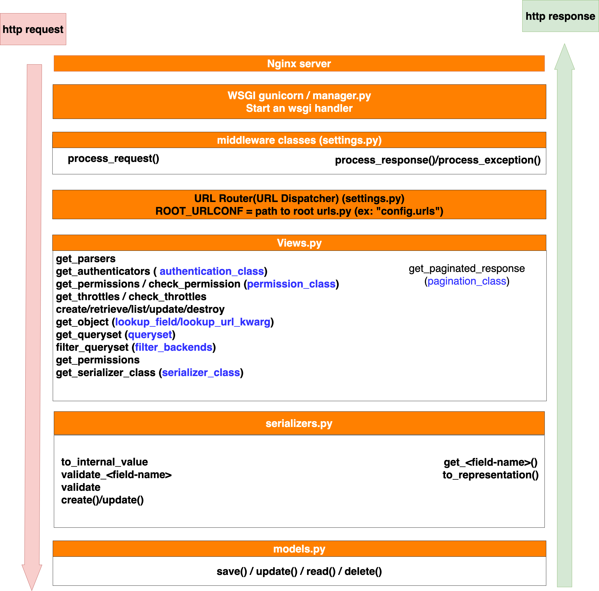

This is sample source code in Django Rest Framework.
It walk through almost all important aspects of Django Rest Framework with some best practices.
---

- [1. Django rest framework request response cycle](#1-django-rest-framework-request-response-cycle)
- [2. setup environment](#2-setup-environment)
- [3. create project and User app](#3-create-project-and-user-app)
  - [3.1. create project and app](#31-create-project-and-app)
  - [3.2. create sample data](#32-create-sample-data)
- [4. Run server](#4-run-server)
  - [4.1. Access swagger](#41-access-swagger)
  - [4.2. Access admin site](#42-access-admin-site)
  - [4.3. Access users/groups apis](#43-access-usersgroups-apis)
- [5. Music app](#5-music-app)
  - [5.1. Create new app and migrate database](#51-create-new-app-and-migrate-database)
  - [5.2. Views](#52-views)
    - [5.2.1. musican-api-views](#521-musican-api-views)
    - [5.2.2. musican-generic-views](#522-musican-generic-views)
    - [5.2.3. musican-viewset](#523-musican-viewset)
    - [5.2.4. musican-debug](#524-musican-debug)
  - [5.3. Serializers](#53-serializers)
    - [5.3.1. Common serializer](#531-common-serializer)
    - [5.3.2. Model serializer](#532-model-serializer)
- [6. Using serializer effectively](#6-using-serializer-effectively)
  - [6.1. In read data](#61-in-read-data)
    - [6.1.1. Using source keyword](#611-using-source-keyword)
    - [6.1.2. Using SerializerMethod](#612-using-serializermethod)
    - [6.1.3. Using to_representation](#613-using-to_representation)
  - [6.2. In write data](#62-in-write-data)
    - [6.2.1. Add custom field validator](#621-add-custom-field-validator)
    - [6.2.2. Cross field validation](#622-cross-field-validation)
    - [6.2.3. When and how to override to_internal_value()](#623-when-and-how-to-override-to_internal_value)
    - [6.2.4. When and how to override create()](#624-when-and-how-to-override-create)
  - [6.3. Other things](#63-other-things)
    - [6.3.1. Passing a value directly to the save method](#631-passing-a-value-directly-to-the-save-method)
    - [6.3.2. Get current user of the request](#632-get-current-user-of-the-request)
    - [6.3.3. HiddenField](#633-hiddenfield)
    - [6.3.4. access serializer raw input](#634-access-serializer-raw-input)
    - [6.3.5. Override data to force ordering](#635-override-data-to-force-ordering)
    - [6.3.6. Handling multiple creates/updates/deletes in nested serializers](#636-handling-multiple-createsupdatesdeletes-in-nested-serializers)
- [7. Other tricks](#7-other-tricks)
  - [7.1. django-rest-framework-tricks](#71-django-rest-framework-tricks)
  - [7.2. Customizing the generic views](#72-customizing-the-generic-views)
- [8. QuerySet](#8-queryset)
- [9. Search-Filter-Ordering](#9-search-filter-ordering)
  - [9.1. Filter base on url and query params](#91-filter-base-on-url-and-query-params)
  - [9.2. Using 3rd Filter Class](#92-using-3rd-filter-class)
  - [9.3. Search](#93-search)
  - [9.4. Ordering](#94-ordering)
  - [9.5. Compose search filter ordering in one viewsets](#95-compose-search-filter-ordering-in-one-viewsets)
- [10. Pagination](#10-pagination)
- [11. Sequence diagram](#11-sequence-diagram)


# 1. Django rest framework request response cycle



WSGI is a tool created to solve a basic problem: connecting a web server to a web framework. WSGI has two sides: the ‘server’ side and the ‘application’ side. To handle a WSGI response, the server executes the application and provides a callback function to the application side. The application processes the request and returns the response to the server using the provided callback. Essentially, the WSGI handler acts as the gatekeeper between your web server (Apache, NGINX, etc) and your Django project.

**Data flow**

When the user makes a request of your application, a WSGI handler is instantiated, which:

  1. imports your `settings.py` file and exception classes.
  2. loads all the middleware classes it finds in the `MIDDLEWARES` tuple located in `settings.py`
  3. builds four lists of methods which handle processing of request, view, response, and exception.
  4. loops through the request methods in middleware, running them in order
  5. resolves the requested URL
  6. loops through each of the view processing methods
  7. calls the view function
  8. processes any exception methods
  9. loops through each of the response methods, (from the inside out, reverse order from request middlewares)
  10. finally builds a return value and calls the callback function to the web server


# 2. setup environment

```shell
pyenv install -v 3.8.0
pyenv local 3.8.0
python --version
which python
venv-create     # if it detect wrong version of python, it need to open another shell
.venv
which python
pip install -r requirements.txt

# mac 
brew install jq
# ubuntu
sudo apt-get install jq -y
```

# 3. create project and User app

create this app as link: https://www.django-rest-framework.org/tutorial/quickstart/

## 3.1. create project and app

**NOTE**: Ignore this step if User app is created

```shell
django-admin startproject main .
django-admin startapp user
```

## 3.2. create sample data

```shell
make create-sample-data
```

# 4. Run server

make run

## 4.1. Access swagger

http://127.0.0.1:8027/swagger/

## 4.2. Access admin site

Account as above: admin/admin
  
**Admin normal**

http://127.0.0.1:8027/admin

## 4.3. Access users/groups apis

http://127.0.0.1:8027/api/v1

login by above account: admin/admin

or by command: 

```shell
make user-get
```

[music/serializers.py](music/serializers.py)

# 5. Music app

We will use this app for demonstrate all importance aspects of django rest framework 

## 5.1. Create new app and migrate database

```shell
# django-admin startapp music
make makemigrations
make migrate
```
access: http://127.0.0.1:8027/swagger/

## 5.2. Views
### 5.2.1. musican-api-views

This set of apis describle how to using `APIView` to make api as basic and normal, code will be handle by yourself

**Test:**

```shell
make musican-api-views-
```

**Conclusion:**

Using api views when you want to custom detail in your api

### 5.2.2. musican-generic-views

This set of apis describle how to using `generics` view to make api code will be made shorter

**Test:**

```shell
make musican-generic-views-
```

**Conclusion:**

Using generic view when you want to combine some methods in one view, but not all, ex: only allow methods: CREATE/GET/LIST

### 5.2.3. musican-viewset

This set of apis describle how to using `ModelViewSet` to make code shortest

**Test:**

```shell
make musican-viewset-
```

**Conclusion:**

Using viewset when you want to add all methods(actions) of a object in one view, all methods will be routed automatically

### 5.2.4. musican-debug

This apis help to debug all django rest framework flow, how a request is handled through all layers of this framework

Uncomment below line in settings.py

```python
MIDDLEWARE = [
    # 'main.middlewares.DebugpyMiddleware', 
```

```shell
make debug-
```

## 5.3. Serializers

### 5.3.1. Common serializer

This type of serializer you don't need to specify your model, but you must declare all neccessary fields manually

Ex: **MusicianSerializer** [music/serializers.py](music/serializers.py)

Ex: using this serializer here: [music/generic_views.py](music/generic_views.py)

### 5.3.2. Model serializer

You must specify your model in **Meta class**

You don't need to specify model field

Ex: [music/model_serializers.py](music/model_serializers.py)

# 6. Using serializer effectively

## 6.1. In read data

### 6.1.1. Using source keyword

Reference: https://medium.com/better-programming/how-to-use-drf-serializers-effectively-dc58edc73998

Using `source` when you only want to get data, but not modify anything

code sample in this serializer: **MusicianModelSerializerReadEffective_SourceKeyword** in this file: [music/sample_using_serializer_effective/serializers.py](music/sample_using_serializer_effective/serializers.py)

- source=field_name to rename of this returned field, ex: `source='first_name'`
- source=Model.method() to get modified data, ex: `source='get_full_name'`
- source work with relationships, ex: `OneToMany` or`ForeignKey`, `OneToOneField`, and `ManyToMany`
  - ex: `source='profile.street'` or `source='profile.city`
- source work with methods of related objects, same `Model.method()`, ex: `source="profile.get_full_address"`
- source work with `OneToMany`, ex: `source='album_set'`. **NOTE** with `ManyToMany` don't need `source`, ex: `instruments` field

### 6.1.2. Using SerializerMethod

Using `SerializerMethod` when you want to custom more output data. For example:

- Convert `first_name` to titlecase during serialization.
- Convert `full_name` to uppercase.
- Set `albums` as `None` instead of an empty list if no groups are associated with the user.

All example in this serializer: **MusicianModelSerializerReadEffective_SerializerMethod** in file [music/sample_using_serializer_effective/serializers.py](music/sample_using_serializer_effective/serializers.py)

### 6.1.3. Using to_representation

Using to_representation when you want to custom mutiple data fields

All example in this serializer: **MusicianModelSerializerReadEffective_SerializerMethod** in file [music/sample_using_serializer_effective/serializers.py](music/sample_using_serializer_effective/serializers.py)


## 6.2. In write data

Reference: https://medium.com/@raaj.akshar/how-to-effectively-use-django-rest-framework-serializers-during-write-operations-dd73b62c26b5

### 6.2.1. Add custom field validator

Using it when want to validate a single field

Ex: field `password` in **MusicianModelSerializerReadEffective_SourceKeyword.validate_password()**

### 6.2.2. Cross field validation

Using it when we want to add some validation where we need to access multiple field simultaneously

Ex: validate that the `first_name` and `last_name` be different in **MusicianModelSerializerReadEffective_SourceKeyword.validate()**

### 6.2.3. When and how to override to_internal_value()

`to_internal_value()`  can be used to do some pre-processing before validation code is executed

Ex 1: Frontend or mobile app sends user information enclosed in another dictionary with key `user`

```json
{
	'user': {
		'first_name': 'john',
		'last_name': 'doe',
		'username': 'john',
		'password': 'abc123#'
	}
}
```

In such case, `user` info needs to be extracted out of the dictionary before the fields are validated. We can achieve this by overriding `to_internal_value()` in **MusicianModelSerializerReadEffective_SourceKeyword.to_internal_value()**

### 6.2.4. When and how to override create()

`create()` is called when `serializer.save()` is called

create() should be overridden when we want to do something different from this default behavior.

## 6.3. Other things

### 6.3.1. Passing a value directly to the save method

```python
serializer = EmailSerializer(data=request.data)
serializer.is_valid(raise_exception=True)
serializer.save(owner_id=request.user.id)   # <------ this passed value won't be validated
											# It may be used to force an override of the initial data
```

### 6.3.2. Get current user of the request

```python
serializers.CurrentUserDefault()
```

### 6.3.3. HiddenField

HiddenField is a field class that does not take a value based on user input, but instead takes its value from a default value or callable.

```python
modified = serializers.HiddenField(default=timezone.now)
owner = serializers.HiddenField(default=serializers.CurrentUserDefault())
```

### 6.3.4. access serializer raw input

`serializer.initial_data`

### 6.3.5. Override data to force ordering

By default, Django querysets are not ordered at all. Enforcing ordering on the list view can easily be accomplished by adding ordering to the view’s `queryset`, but in cases where nested resources should also be ordered, it’s not so simple. For read-only fields, it can be done within `SerializerMethodField`, but what to do in a situation where a field has to be writable? In such a case, a serializer’s data property can be overridden, as shown in this example:

```python
@property
def data(self):
    data = super().data
    data['phone_numbers'].sort(key=lambda p: p['id'])
    return data
```

### 6.3.6. Handling multiple creates/updates/deletes in nested serializers

There are two paths you can follow in this case:

- use the quite popular, third party library DRF Writable Nested
- do it on your own
  
I would recommend choosing the second option at least once, so you will know what’s going underneath.

After analyzing incoming data, in most scenarios, we are able to make the following assumptions:

- all items that should be updated have id,
- all items that should be created don’t have id,
- all items that should be deleted are present in data storage (eg. database), but are missing in the incoming request.data
  
Based on this, we know what to do with particular items on the list. Below is a snippet that shows this process in detail:

```python
class CUDNestedMixin(object):
    @staticmethod
    def cud_nested(queryset: QuerySet,
                   data: List[Dict],
                   serializer: Type[Serializer],
                   context: Dict):
        """
        Logic for handling multiple updates, creates and deletes
        on nested resources.
        :param queryset: queryset for objects existing in DB
        :param data: initial data to validate passed from higher
                level serializer to nested serializer
        :param serializer: nested serializer to use
        :param context: context passed from higher level
                serializer
        :return: N/A
        """
        updated_ids = list()
        for_create = list()
        for item in data:
            item_id = item.get('id')
            if item_id:
                instance = queryset.get(id=item_id)
                update_serializer = serializer(
                    instance=instance,
                    data=item,
                    context=context
                )
                update_serializer.is_valid(raise_exception=True)
                update_serializer.save()
                updated_ids.append(instance.id)
            else:
                for_create.append(item)

        delete_queryset = queryset.exclude(id__in=updated_ids)
        delete_queryset.delete()

        create_serializer = serializer(
            data=for_create,
            many=True,
            context=context
        )
        create_serializer.is_valid(raise_exception=True)
        create_serializer.save()
```

And here is the simplified version of how a high-level serializer can make use of this mixin:

```python
from rest_framework import serializers

class AccountSerializer(serializers.ModelSerializer,
                        CUDNestedMixin):
    phone_numbers = PhoneSerializer(
        many=True,
        source='phone_set',
    )

    class Meta:
        model = User
        fields = ('first_name', 'last_name', 'phone_numbers')

    def update(self, instance, validated_data):
        self.cud_nested(
            queryset=instance.phone_set.all(),
            data=self.initial_data['phone_numbers'],
            serializer=PhoneSerializer,
            context=self.context
        )
        ...
        return instance
```

Keep in mind that nested objects should consume `initial_data` instead of `validated_data`. That’s because running validation calls `field.to_internal_value()` on each of a serializer’s fields, which may modify data stored by a particular field (eg. by changing primary key to model instance).


# 7. Other tricks

## 7.1. [django-rest-framework-tricks](https://github.com/barseghyanartur/django-rest-framework-tricks)

## 7.2. [Customizing the generic views](https://www.django-rest-framework.org/api-guide/generic-views/#customizing-the-generic-views)


# 8. QuerySet

https://docs.djangoproject.com/en/3.1/topics/db/queries/

A django queryset is like its name says, basically a collection of (sql) queries, in your example above print(b.query) will show you the sql query generated from your django filter calls.

Since querysets are lazy, the database query isn't done immediately, but only when needed - when the queryset is evaluated. This happens for example if you call its __str__ method when you print it, if you would call list() on it, or, what happens mostly, you iterate over it (for post in b..). This lazyness should save you from doing unnecessary queries and also allows you to chain querysets and filters for example (you can filter a queryset as often as you want to).


# 9. Search-Filter-Ordering

Refer: https://www.django-rest-framework.org/api-guide/filtering/#filtering-against-the-current-user

## 9.1. Filter base on url and query params

```python
    # re_path('^purchases/(?P<username>.+)/$', PurchaseList.as_view()),
    
    def get_queryset(self):
        """
        This view should return a list of all the purchases
        for the currently authenticated user.
        """
        user = self.request.user
        return Purchase.objects.filter(purchaser=user)
```

```python
    # http://example.com/api/purchases?username=denvercoder9
    def get_queryset(self):
        """
        Optionally restricts the returned purchases to a given user,
        by filtering against a `username` query parameter in the URL.
        """
        queryset = Purchase.objects.all()
        username = self.request.query_params.get('username', None)
        if username is not None:
            queryset = queryset.filter(purchaser__username=username)
        return queryset
```

## 9.2. Using 3rd Filter Class

Sample in file: [viewsets.py](music/sample_search_filter_ordering/viewsets.py)

```python
filter_backends = [DjangoFilterBackend]
filterset_class = MusicanFilter   # filter class also support filter relation field, ex: profile__num_stars
```

Test command:

```shell
make musican-sample-filter-list-FILTER
# NOTE: test also affect get single object, test with below command
make musican-sample-filter-get-FILTER
```

## 9.3. Search

Sample add search feature in file [viewsets.py](music/sample_search_filter_ordering/viewsets.py)

```python
# filter_backends = [filters.SearchFilter]
filter_backends = [CustomSearchFilter]
search_fields = ['=first_name', '=last_name', '=email', '=profile__city']
```

Test with command:

```shell
make musican-sample-search-list-SEARCH-city
make musican-sample-search-list-SEARCH-last_name
make musican-sample-search-list-SEARCH-last_name_only
```

The search behavior may be restricted by prepending various characters to the *search_fields* :

    '^' Starts-with search.
    '=' Exact matches.
    '@' Full-text search. (Currently only supported Django's PostgreSQL backend.)
    '$' Regex search.

## 9.4. Ordering

Sample code in file: [viewsets.py](music/sample_search_filter_ordering/viewsets.py)

```python
filter_backends = [rest_filters.OrderingFilter]
ordering_fields = ['last_name', 'first_name', 'email']
ordering = ['email']    # default field for ordering
```

Test with command: 

```shell
make musican-sample-ordering-list-ORDERING-email
make musican-sample-ordering-list-ORDERING-email-last_name
```

## 9.5. Compose search filter ordering in one viewsets

Sample code in file: [viewsets.py](music/sample_search_filter_ordering/viewsets.py)

```python
class MusicianListRetriveViews_Filter_Search_Order(mixins.ListModelMixin, mixins.RetrieveModelMixin, viewsets.GenericViewSet):
```

Test commands: 

```shell
make musican-sample-search-list-SEARCH-ORDERING-city
make musican-sample-filter-list-FILTER-ORDERING
```

# 10. Pagination

Declare default pagination class in file: [settings.py](main/settings.py)

```python
REST_FRAMEWORK = {
    'DEFAULT_PAGINATION_CLASS': 'rest_framework.pagination.PageNumberPagination',
    # 'DEFAULT_PAGINATION_CLASS': 'rest_framework.pagination.LimitOffsetPagination',
    # 'DEFAULT_PAGINATION_CLASS': 'rest_framework.pagination.CursorPagination',
    'PAGE_SIZE': 10
}
```

Example of using custom pagination class in file: [generic_views.py](music/views/generic_views.py) and file [custom_paginations.py](music/paginations/custom_paginations.py)

```python
class MusicListCreateView(generics.ListCreateAPIView):
    # pagination_class = StandardResultsSetPagination
    pagination_class = CustomPagination
```

Reference: https://www.django-rest-framework.org/api-guide/pagination/#pagination-schemas

Test command:

```shell
make musican-generic-views-list
```

# 11. Sequence diagram

Below is sequence diagram for List api, run this repo in debug mode as guide in this part [5.2.4. musican-debug](#524-musican-debug) to see sequence calling methods of others api


