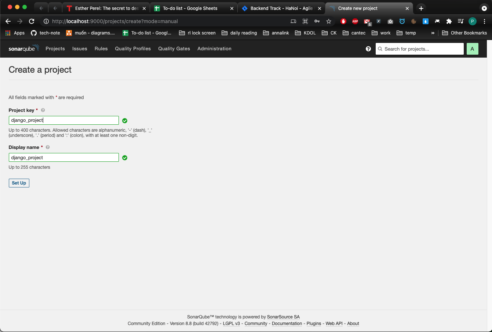
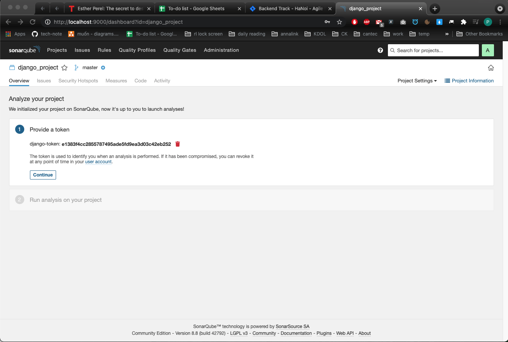
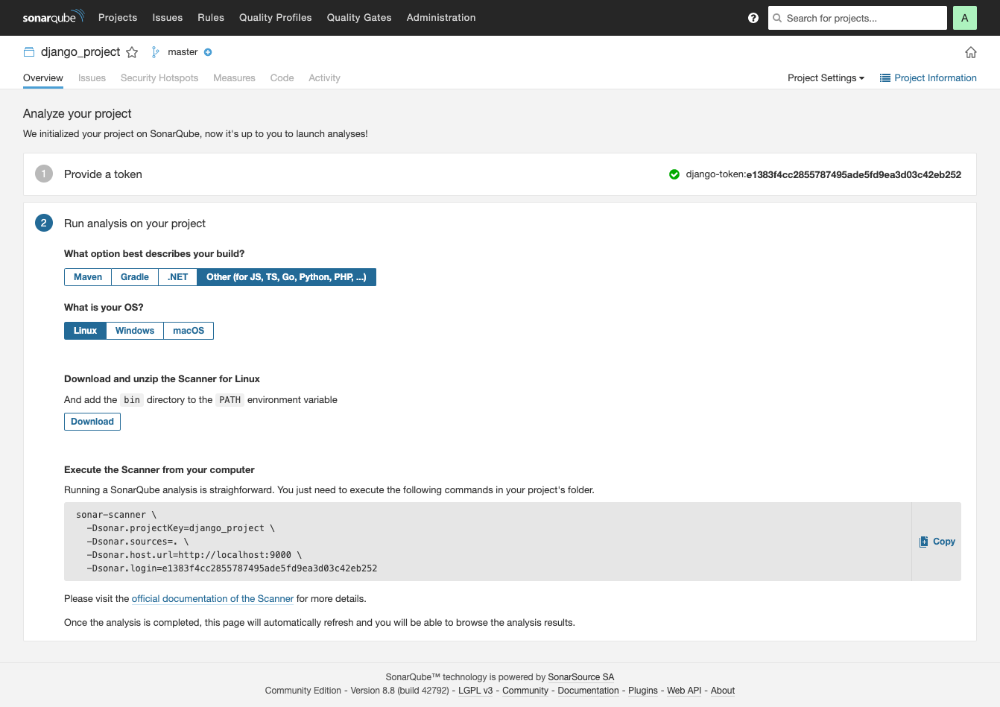
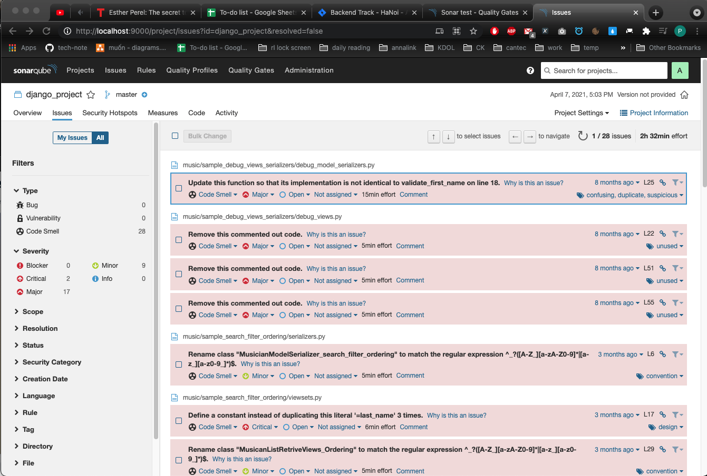
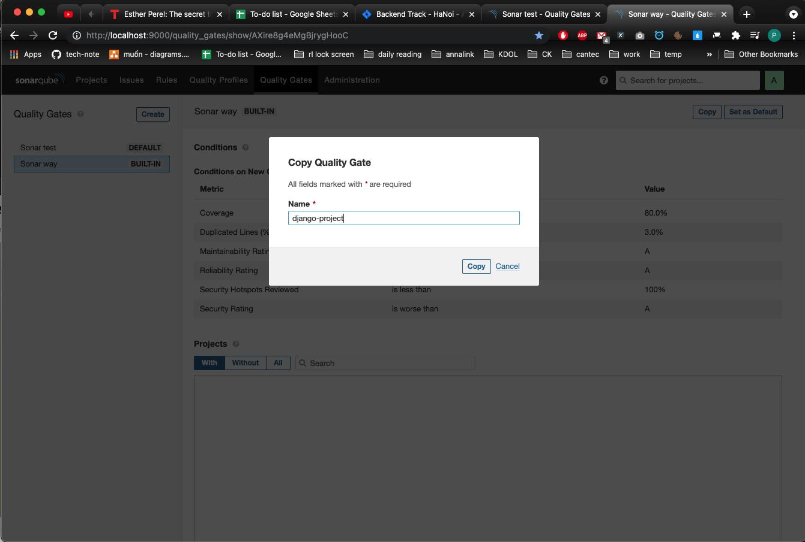
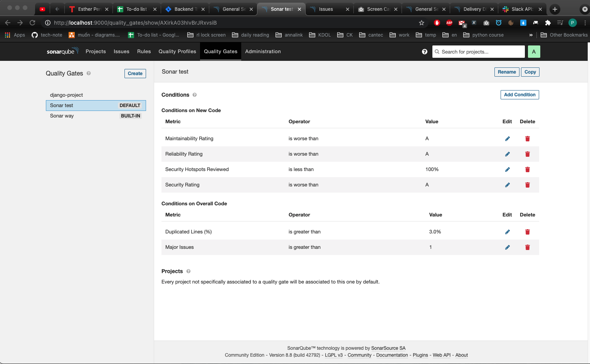
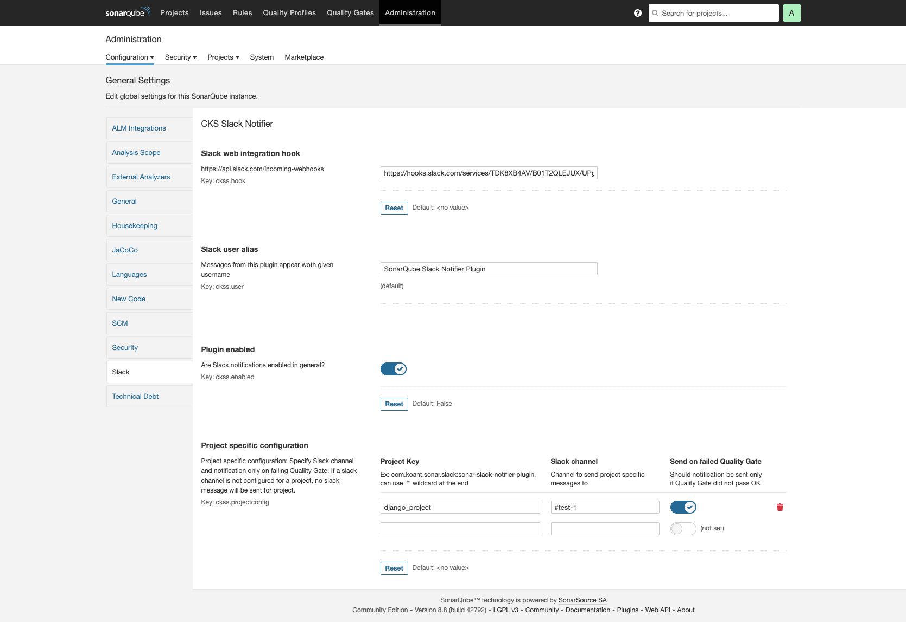

- [1. Create project](#1-create-project)
- [2. Run sonarqube](#2-run-sonarqube)
  - [2.1. Install sonarqube client](#21-install-sonarqube-client)
  - [2.2. Run with config](#22-run-with-config)
  - [2.3. Run directly](#23-run-directly)
  - [2.4. See test result](#24-see-test-result)
- [3. Config quality gates](#3-config-quality-gates)
- [4. Config slack alert](#4-config-slack-alert)

# 1. Create project 

http://localhost:9000/projects/create?mode=manual



enter token name, then click generate:



Then, at step 2, choose Other and OS is Linux



If you want, access this link for guide how to run install and run sona scanner:

http://localhost:9000/documentation/analysis/scan/sonarscanner/

# 2. Run sonarqube

## 2.1. Install sonarqube client

On client where you want to run sonarqube client :

```shell
# -- choose file base on your OS ---

# -- for linux
wget https://binaries.sonarsource.com/Distribution/sonar-scanner-cli/sonar-scanner-cli-4.6.0.2311-linux.zip
tar -xvf sonar-scanner-cli-4.6.0.2311-linux.zip

# for mac os
wget https://binaries.sonarsource.com/Distribution/sonar-scanner-cli/sonar-scanner-cli-4.6.0.2311-macosx.zip
tar -xvf sonar-scanner-cli-4.6.0.2311-macosx.zip
```

## 2.2. Run with config

add config as file [sonar.properties](../sonar.properties) to your project folder, then run :

```shell
sonar-scanner
```

## 2.3. Run directly 

```shell
cd django-rest-framework-sample
/Users/xuananh/Downloads/sonar-scanner-4.6.0.2311-macosx/bin/sonar-scanner \
  -Dsonar.projectKey=django_project \
  -Dsonar.sources=. \   
  -Dsonar.host.url=http://localhost:9000 \
  -Dsonar.login=e1383f4cc2855787495ade5fd9ea3d03c42eb252
```

## 2.4. See test result

http://localhost:9000/project/issues?id=django_project&resolved=false

See part: Critical, Major



# 3. Config quality gates

config how to scan and test source code

http://localhost:9000/quality_gates

copy already built-in config **Sonar way** and set another name 



Add and remove some conditions as below :



There are to part to apply a condition, apply a condition to **Conditions on New Code** or **Conditions on Overall Code**


# 4. Config slack alert

Get webhook:

        1. How to get webhook, go to: https://api.slack.com/apps
        2. Choose your app in below of website
        3. Choose `Incomming Webhooks` , at left side
        4. Choose `Activate Incoming Webhooks` button if it not enabled yet
        5. Move to below, Choose `Add New Webhook to Workspace`

http://localhost:9000/admin/settings?category=slack


